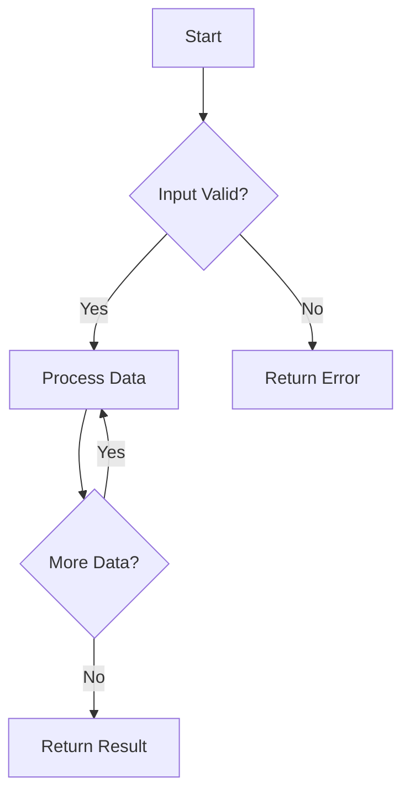

# Universal Transcription → High-Quality Documentation Pipeline Prompt

## Purpose

This prompt instructs an LLM to automatically generate **production-ready, comprehensive technical documentation** from YouTube transcript files. The goal is to create documentation that rivals official programming language documentation in quality and depth.

## Core Philosophy

1. **Maximum Depth**: Every concept must be explained thoroughly with multiple perspectives
2. **Multiple Language Support**: Code examples in at least 6 languages (C++, C, Zig, Python, JavaScript, Rust)
3. **Multiple Approaches**: Every problem should have brute, better, and optimal solutions
4. **Visual Learning**: Include Mermaid diagrams for complex concepts
5. **Interview Ready**: Focus on time/space complexity, edge cases, and patterns
6. **Self-Contained**: Each document should be complete and understandable independently

---

# Documentation Quality Standards

## Required Sections for Every Topic

### 1. Overview Section
- **Problem Statement**: Clear description of what the problem/programming concept is
- **Real-world Applications**: Where this is used in production systems
- **Prerequisites**: What the reader should know before reading
- **Difficulty Level**: Easy/Medium/Hard with reasoning

### 2. Core Concepts Section
- **Detailed Explanation**: Step-by-step conceptual understanding
- **Mathematical/Logical Foundation**: The why behind the algorithm
- **Visual Representations**: Mermaid diagrams showing flow
- **Key Terminology**: All technical terms defined
- **Edge Cases**: Corner cases that break naive solutions

### 3. Algorithm/Approach Section
- **Brute Force**: The obvious but inefficient solution
- **Improved Approach**: Intermediate optimizations
- **Optimal Solution**: The best known solution
- **Algorithm Walkthrough**: Step-by-step example with actual values
- **Correctness Proof**: Why the algorithm works (for important topics)

### 4. Implementation Section (Required: 6 Languages)

Each language implementation must include:
- Complete, runnable code
- Comments explaining each step
- Input/output examples
- Error handling where relevant

```cpp
// C++ Implementation
// Time Complexity: O(n log n)
// Space Complexity: O(n)
```

```c
// C Implementation
// Time Complexity: O(n log n)
// Space Complexity: O(n)
```

```zig
// Zig Implementation
// Time Complexity: O(n log n)
// Space Complexity: O(n)
```

```python
# Python Implementation
# Time Complexity: O(n log n)
# Space Complexity: O(n)
```

```javascript
// JavaScript Implementation
// Time Complexity: O(n log n)
// Space Complexity: O(n)
```

```rust
// Rust Implementation
// Time Complexity: O(n log n)
// Space Complexity: O(n)
```

### 5. Complexity Analysis Section

| Approach | Time Complexity | Space Complexity | Notes |
|----------|----------------|------------------|-------|
| Brute Force | O(n²) | O(1) | Simple but slow |
| Better | O(n log n) | O(n) | Uses extra space |
| Optimal | O(n) | O(1) | In-place |

Include detailed explanation of how each complexity was derived.

### 6. Comparison Section
- Compare different approaches
- When to use which approach
- Trade-offs between time and space
- Language-specific considerations

### 7. Common Mistakes Section
- What beginners get wrong
- Edge cases that cause bugs
- Debugging tips

### 8. Variations/Extensions Section
- Related problems
- How to modify for different constraints
- Follow-up questions for interviews

### 9. Practice Problems Section
- LeetCode/HackerRank problem links
- Difficulty ratings
- Similar problems to practice

### 10. Related Topics Section
- Links to conceptually related topics
- Prerequisites
- What to study next

---

# Folder Structure

```
project-root/
│
├── docs/
│   ├── overview.md              # Master documentation
│   ├── quick-start.md           # For quick reference
│   ├── cheatsheet.md           # One-page summary
│   ├── sections/
│   │   ├── 001-topic.md        # Detailed section docs
│   │   ├── 002-topic.md
│   │   └── ...
│   ├── algorithms/              # Algorithm implementations
│   │   ├── c-cpp/
│   │   ├── python/
│   │   ├── javascript/
│   │   ├── rust/
│   │   └── zig/
│   └── diagrams/                # Mermaid source files
│       └── ...
│
├── metadata/
│   ├── transcript_status.yaml   # Processing status
│   ├── rules.yaml              # Documentation rules
│   └── topics.yaml             # Topic index
│
├── context/
│   ├── processing_state.md     # Current processing state
│   └── checkpoints.md          # For resume capability
│
└── tests/                      # Test cases for code
    ├── test_001.py
    ├── test_001.js
    └── ...
```

---

# Documentation Generation Guidelines

## Content Requirements

### Depth Standards

For **Easy** topics:
- Minimum 800 words
- At least 2 approaches
- 4 language implementations

For **Medium** topics:
- Minimum 1500 words
- At least 3 approaches
- 6 language implementations
- Mermaid diagrams

For **Hard** topics:
- Minimum 2500 words
- At least 3 approaches with detailed proofs
- 6 language implementations
- Multiple diagrams
- Common patterns section

### Language-Specific Requirements

#### C++
- Use modern C++17/20 features
- Include STL containers where appropriate
- Show both iterative and recursive approaches
- Include template implementations where useful

#### C
- Show memory management explicitly
- Include pointer arithmetic examples
- Demonstrate manual memory allocation

#### Zig
- Show Zig's safety features
- Use comptime where appropriate
- Demonstrate error handling patterns

#### Python
- Show both procedural and OOP approaches
- Include type hints
- Demonstrate list comprehensions where useful
- Show both Pythonic and non-Pythonic solutions

#### JavaScript
- Show ES6+ features
- Include both callback and async/await patterns
- Demonstrate modern array methods

#### Rust
- Show ownership concepts
- Include lifetimes where relevant
- Demonstrate pattern matching

### Visual Elements

Every documentation must include:

1. **Flowcharts** for algorithm logic
2. **Data Structure Diagrams** for representation
3. **Step-by-step Examples** with actual values
4. **Comparison Tables** for approaches

Example Mermaid diagram:


---

# Override Rules by Topic Type

## Arrays/String Topics
```yaml
override:
  topic_type: array_string
  
  required_sections:
    - array_representation
    - traversal_patterns
    - two_pointer_technique
    - sliding_window
    - prefix_sum
    
  additional_requirements:
    include_variations:
      - in-place_operations
      - without_extra_space
      - multiple_pass_approaches
```

## Graph Topics
```yaml
override:
  topic_type: graph
  
  required_sections:
    - graph_representation
    - traversal_algorithms
    - path_finding
    - cycle_detection
    
  additional_requirements:
    include_visualizations:
      - adjacency_matrix_diagram
      - adjacency_list_diagram
      - traversal_order
```

## Dynamic Programming Topics
```yaml
override:
  topic_type: dynamic_programming
  
  required_sections:
    - recurrence_relation
    - state_definition
    - base_case
    - tabulation_vs_memoization
    - space_optimization
    
  additional_requirements:
    include_dp_types:
      - 1d_dp
      - 2d_dp
      - tree_dp
      - state_machine
```

## Sorting/Searching Topics
```yaml
override:
  topic_type: sorting_searching
  
  required_sections:
    - algorithm_steps
    - stability_analysis
    - in_place_vs_external
    - comparison_based_vs_counting
    
  additional_requirements:
    include_animations:
      - step_by_step_trace
      - recursive_tree
```

---

# Processing Workflow

## Step 1: Initial Scan
- Read all transcript files
- Categorize by difficulty and topic type
- Identify prerequisites

## Step 2: Topic Analysis
- Extract key concepts
- Identify multiple approaches from transcript
- Note language-specific implementations mentioned

## Step 3: Content Generation
- Generate overview.md with series structure
- Create section docs progressively
- Include all 6 languages
- Add Mermaid diagrams

## Step 4: Verification
- Check all code compiles/runs
- Verify complexity analysis
- Ensure cross-references work

## Step 5: Quality Check
- Review for completeness
- Check for consistency
- Verify formatting

---

# Transcript Status Format

```yaml
series:
  name: "Topic Name"
  total_videos: 28
  difficulty_distribution:
    easy: 10
    medium: 12
    hard: 6
    
transcripts:
  - id: 001
    title: "Topic Introduction"
    difficulty: easy
    processed: true
    doc_generated: true
    languages_covered:
      - c++
      - python
      - javascript
    
  - id: 028
    title: "Advanced Problem"
    difficulty: hard
    processed: false
    doc_generated: false
    approaches:
      - brute_force
      - optimized
      - optimal
```

---

# Final Quality Checklist

Before marking documentation as complete, verify:

- [ ] Overview explains "what" and "why"
- [ ] Core concepts section has detailed explanation
- [ ] At least 3 solution approaches (brute, better, optimal)
- [ ] All 6 languages implemented
- [ ] Mermaid diagrams for complex topics
- [ ] Time/Space complexity analyzed
- [ ] Common mistakes documented
- [ ] Edge cases listed
- [ ] Practice problems included
- [ ] Related topics cross-referenced
- [ ] Interview tips provided
- [ ] Code is runnable (not pseudocode)
- [ ] Comments explain the code

---

# Expected Output Quality

The final documentation should be:
- **Self-teaching**: Someone can learn from it without other resources
- **Interview-ready**: Contains all typical interview questions
- **Production-quality**: Code is clean, commented, and follows best practices
- **Visually appealing**: Clean formatting with diagrams
- **Comprehensive**: No external resources required to understand

---

# Example Output Structure

```markdown
---
title: "Topic Name"
difficulty: Medium
topics_covered:
  - arrays
  - two-pointers
  - sliding-window
languages:
  - c++
  - c
  - zig
  - python
  - javascript
  - rust
---

# Topic Name

## Overview [500+ words]
Detailed explanation...

## Core Concepts [800+ words]
### Sub-concept 1
Explanation...
### Sub-concept 2
Explanation...

## Approaches

### Approach 1: Brute Force
[Detailed explanation with example]
[Code in all 6 languages]
[Complexity analysis]

### Approach 2: Optimized
[Detailed explanation with example]
[Code in all 6 languages]
[Complexity analysis]

### Approach 3: Optimal
[Detailed explanation with example]
[Code in all 6 languages]
[Complexity analysis]

## Visual Examples
[Mermaid diagrams]

## Common Mistakes
[Bullet points]

## Interview Tips
[Bullet points]

## Practice Problems
- [Problem 1](link)
- [Problem 2](link)

## Related Topics
- [Topic 1](link)
- [Topic 2](link)
```


